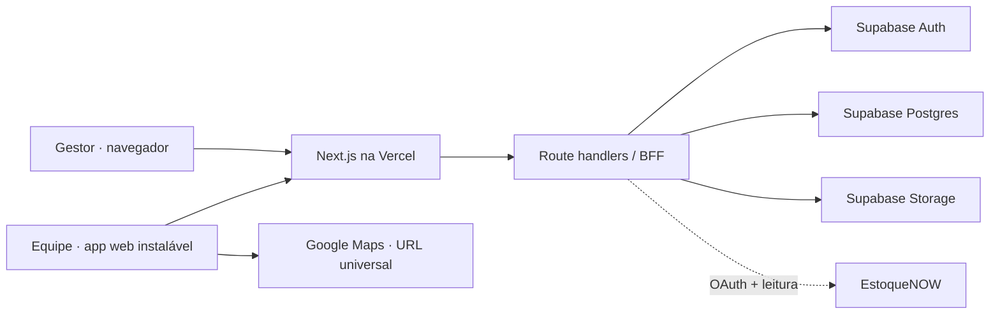

# Arquitetura remota — logística Império Eventos

Atualizado em 30 de agosto de 2026.

## Decisão

Usar um monólito modular em Next.js, hospedado na Vercel, e um único projeto Supabase. A torre web, a superfície instalável de campo e a API server-side são o mesmo produto e o mesmo deploy. Não criar microsserviços agora.

Essa é a menor arquitetura que entrega autenticação, persistência, fotos, GPS, idempotência e integração server-side sem manter servidores ociosos. O conector do EstoqueNOW permanece isolado por módulo para poder ser extraído depois, caso volume ou tempo de execução comprovem essa necessidade.

## Serviços e responsabilidades

| Componente | Execução | Responsabilidade | Escala inicial |
|---|---|---|---|
| Next.js | Vercel Pro | UI da torre, app de campo, autenticação SSR, validação e API/BFF | Automática e sem servidor dedicado |
| Supabase Auth | Supabase Pro | Sessões de gestor e funcionário | Incluso no projeto |
| Supabase Postgres | Supabase Pro | Pessoas, equipes, frota, operações, eventos, idempotência e auditoria | Instância Micro inicial |
| Supabase Storage | Supabase Pro | Fotos privadas com URL assinada temporária | Mesmo projeto |
| Conector EstoqueNOW | Módulo server-side do Next.js | OAuth, paginação, normalização e importação somente leitura | Executado sob demanda |
| Google Maps | Serviço externo | Abrir rota por URL universal | Sem chave e sem API paga |

Não são microsserviços: `estoquenow.ts`, os route handlers e a fila local do aparelho são módulos do produto. Separá-los agora adicionaria deploys, observabilidade e falhas distribuídas sem reduzir custo ou risco.

## Fonte de verdade

| Domínio | Fonte |
|---|---|
| Pedido, cliente, data e local contratados | EstoqueNOW após conexão |
| Pessoas, equipes, frota e escala operacional | Império/Supabase |
| Etapas, checklist, GPS, fotos, horários e ocorrências | Império/Supabase |
| Entrega, devolução, locação, inventário e financeiro | EstoqueNOW; escrita desabilitada neste módulo |

A importação concilia por `external_id`. Dados operacionais internos não são sobrescritos. Até existir credencial e validação do contrato real, toda operação interna permanece rotulada como manual e não originada do EstoqueNOW.

## Ambientes e custo

| Ambiente | Infraestrutura | Regra |
|---|---|---|
| Local | Next.js + Supabase CLI | Desenvolvimento e testes persistentes sem cloud |
| Preview | Vercel Preview sem credenciais | Demonstração somente leitura com dados explicitamente simulados |
| Produção | Um projeto Vercel Pro + um projeto Supabase Pro | Único ambiente com dados e segredos reais |

Baseline comercial estimada: **US$ 45/mês**, antes de domínio, e-mail e excedentes: Vercel Pro por US$ 20/mês e Supabase Pro por US$ 25/mês. O crédito de compute do Supabase Pro cobre uma instância Micro. Não manter um Supabase de staging 24/7 no início; ele acrescentaria aproximadamente US$ 10/mês de compute sem necessidade atual.

Fontes oficiais: [Vercel Pricing](https://vercel.com/pricing), [Supabase Pricing](https://supabase.com/pricing), [Supabase Compute](https://supabase.com/docs/guides/platform/manage-your-usage/compute) e [Supabase Cost Control](https://supabase.com/docs/guides/platform/cost-control).

## Fluxo de produção

1. Gestor autentica e cadastra funcionário, equipe e veículo.
2. Gestor cria a operação manual ou importa uma operação do EstoqueNOW.
3. Funcionário abre a mesma aplicação no celular e envia a ação com `device_action_id`.
4. Route handler valida sessão, vínculo, etapa, GPS, foto e payload.
5. Postgres confirma a ação uma única vez; Storage mantém a foto privada.
6. A torre lê o mesmo evento confirmado e exibe autor, horário, GPS, checklist e foto assinada.

A fila local representa `pendente` e `confirmado` quando a conexão cai com a aplicação já aberta. O app precisa de internet para abrir ou recarregar: não existe service worker nem cache offline do shell. Ocorrências ainda exigem conexão e conflitos entre ações de aparelhos diferentes precisam de política validada antes de qualquer expansão offline.

## Conectar o EstoqueNOW

1. Receber URL oficial, `client_id`, `client_secret` e documentação ou amostra real da resposta de logística.
2. Configurar apenas `ESTOQUENOW_CLIENT_ID`, `ESTOQUENOW_CLIENT_SECRET` e, se necessário, `ESTOQUENOW_API_URL` no ambiente de produção.
3. Executar o smoke test server-side contra uma janela curta e sem escrita.
4. Comparar IDs, datas, local, paginação e status normalizados com a tela do EstoqueNOW.
5. Importar uma operação canário, confirmar que `external_id` é estável e que a conciliação preserva escala/evidências internas.
6. Liberar a importação por período. Escritas no EstoqueNOW continuam fora de escopo até autorização e contrato próprios.

## Operação e controle de custo

- Definir alertas de orçamento na Vercel e no Supabase antes do go-live.
- Manter fotos privadas, comprimidas no aparelho e com política de retenção definida com a Império.
- Usar logs de função e eventos persistidos; não contratar APM separado no início.
- Fazer backup diário do banco pelo plano Pro e testar restauração antes do uso operacional.
- Manter Preview sem segredos de produção e nunca apontá-lo para o banco real.

## Quando extrair um microsserviço

Extrair somente o conector/importador para uma função scale-to-zero quando uma destas condições for medida:

- uma importação exceder repetidamente o limite de duração da função;
- processamento assíncrono de imagens passar a bloquear a confirmação da etapa;
- o EstoqueNOW exigir webhooks com volume ou disponibilidade independentes;
- falhas do conector começarem a afetar a disponibilidade do fluxo operacional.

Nesse momento, preferir Supabase Edge Functions ou Cloud Run com escala a zero. Não separar Auth, API de operações, fotos ou banco enquanto o produto for de um único cliente e uma única equipe operacional.

## Gate de produção

- Vercel Pro e Supabase Pro criados na região mais adequada disponível.
- Variáveis de produção configuradas; nenhum segredo com prefixo `NEXT_PUBLIC_`.
- Migrações e testes pgTAP aplicados no projeto vazio.
- Primeiro gestor criado e obrigado a trocar a senha temporária.
- Bucket privado e RLS confirmados com gestor e funcionário reais.
- Smoke test do EstoqueNOW concluído em modo somente leitura.
- Fluxo completo validado em celular real: foto, permissão de GPS, reenvio idempotente e evidência na torre.
- Alertas de orçamento, domínio, backup e responsável operacional definidos.
